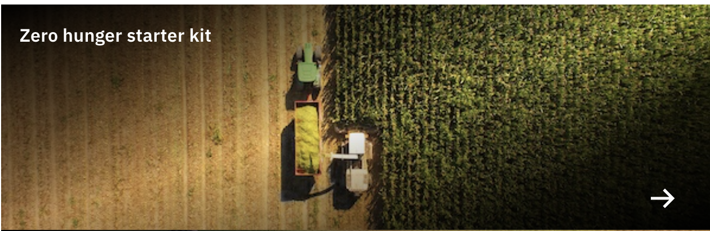
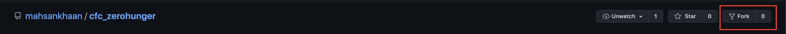
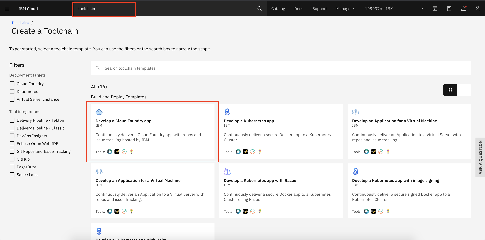
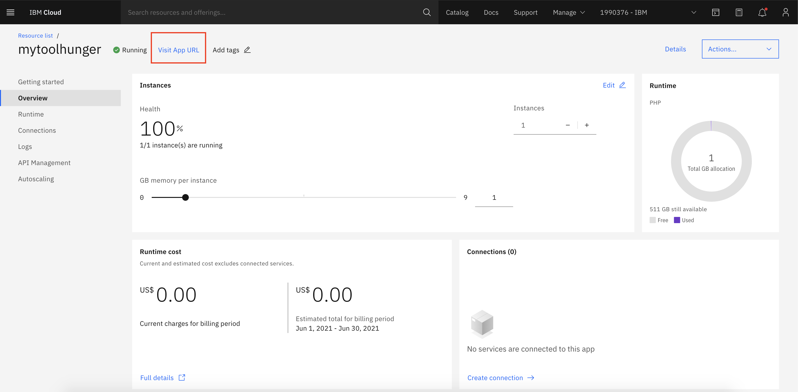

## Steps:
1. [Signup for IBM Cloud Platform and Fork the repository](#step-1-Signup-for-IBM-Cloud-Platform-and-Fork-the-repository)
1. [Login into your IBM account and search for CloudFoundry](#step-2-Login-into-your-IBM-account-and-search-for-CloudFoundry)
1. [Enable Toolchain service for continuous integration and delivery](#step-3-Enable-Toolchain-service-for-continuous-integration-and-delivery)
1. [Finally application would be up and running](#step-4-Finally-application-would-be-up-and-running)

### Step 1. Signup for IBM Cloud Platform and Fork the repository

1. Create IBM Account: [Here](https://ibm.biz/BdfSFy)
1. Open this [repo](https://github.com/mahsankhaan/app-modernization-using-IBM-toolchain.git)
1. And then click on __Fork__ on the top right 

__NOTE:__ Kindly udpdate __manifest.yml__ file, open and change the __name__ filed to something unique. 

### Step 2. Login into your IBM account
IBM Cloud Login-link:[https://cloud.ibm.com/login](https://cloud.ibm.com/login)

### Step 3. Enable Toolchain service for continuous integration and delivery

1. Search for  __Toolchain__ from search bar
2. Then select __Cloud Foundry__ template.

3. There will be Continuous Delivery Toolchain page.

4. In Git repos section insert Source repository URL: 

__NOTE: Please use your OWN fork repo [step 1](#step-1-Signup-for-IBM-Cloud-Platform-and-Fork-the-repository) or else you can't trigger the change__

[https://github.com/mahsankhaan/cfc_zerohunger](https://github.com/mahsankhaan/cfc_zerohunger.git)

5. In Delivery Pipeline section , click "new" to generate API

6. Once everything is done press "Create" button

7. Now your toolchain is created and select "Delivery Pipeline"

8. In __Delivery Pipeline__ start build stage
9. Wait until the __Build stage__ becomes green
10. After that __Delpoy stage__ will trigger and execute automatically 

11. Once both the stages executed successfully they will be in green.

### Step 4. Finally application would be up and running

1. Get back to main page, select resources from left from select CF service

2. Click visit URL and see your app running

